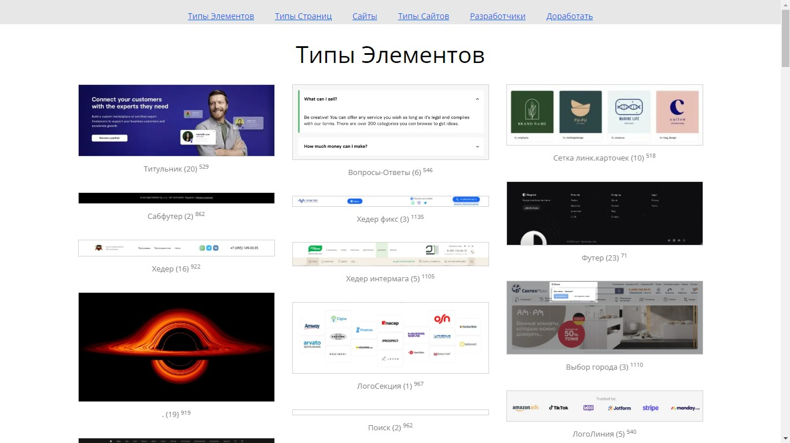
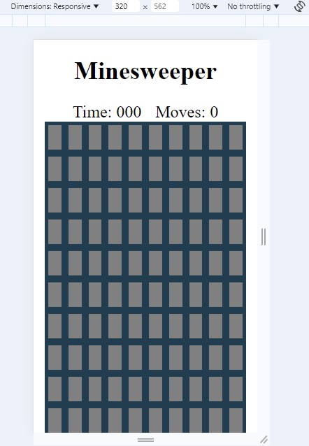

# ProSushi Krakow

[prosushi-krakow.pl](https://prosushi-krakow.pl/)

**Stack:** CMS WordPress, WooCommerce, HTML, CSS, JavaScript, PHP, Google Places API

**Project Description:**
ProSushi Krakow is an e-commerce cafe website for ordering sushi online. The main task was to make edits to the checkout functionality, as well as to develop a custom stamp system and work with coupons for loyal customers.

**My Role:**
- Style edits to the checkout page (buttons, coupon application)
- Integration of address hints in the form via Google Places API Autocomplete
- Implementation of the function of uploading data of all orders to the `data.csv` file by a button in the admin area
- Edits to order placement logic

**Key features:**
- Development of a stamp system for customers (receiving coupons for every N orders)
- Setting up automatic sending of emails with coupons
- Automatic creation and restriction of coupon application by email
- Creating a custom page-table in the admin with data on buyers, their orders and stamps
- HTML-email layout for sending coupons, customized for Gmail
- Ability to manually change the number of stamps for customers

**Key features:**
- Google Places API integration for hints in the address field
- Loyalty system based on stamps and coupons

## Desktop

## Mobile

