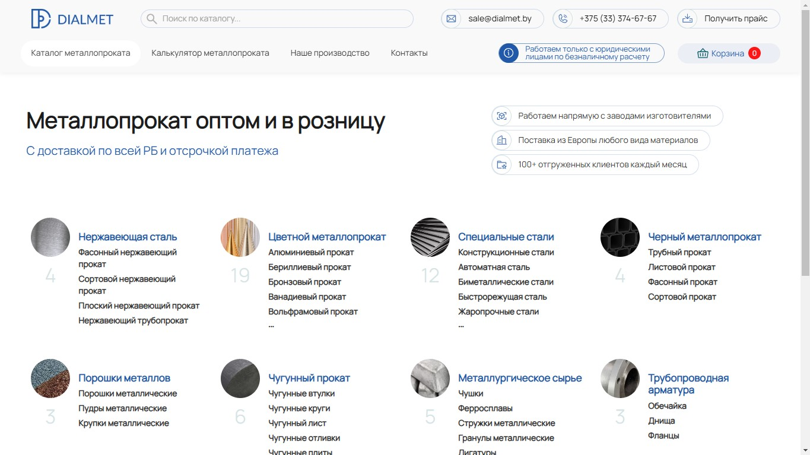
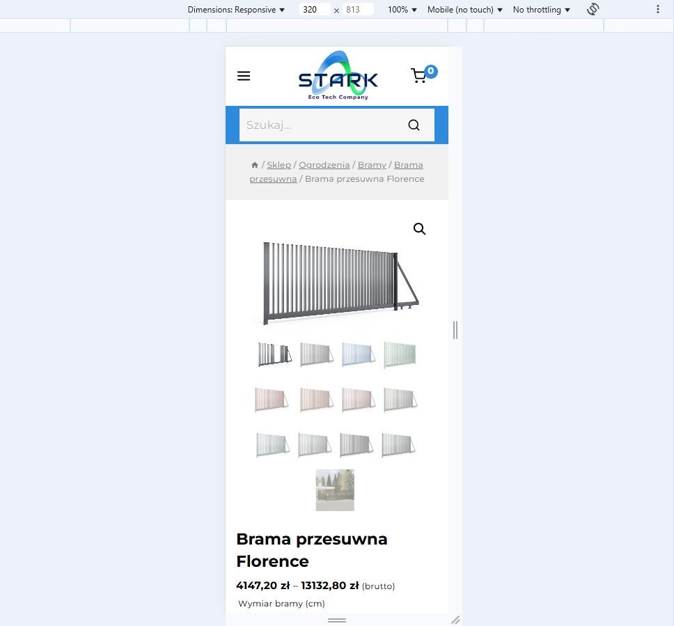

# Paytion

[paytion.com](https://paytion.com/)

**Stack:** CMS ModX, HTML, CSS, SCSS, JavaScript, PHP, Fenom, Manychat API, Slack API, Telegram API, Google Sheets API, Cron  
**ModX Packages:** easyRedirects, FetchIt, MIGX, pdoTools

**Project Description:**
Paytion is a website of a company that provides financial services and products for life and business. The site features multi-language, currency converter and integration with various APIs. The site includes automation and data processing processes from the company's API to display up-to-date currency rates.

**My role:**  
- Realization of currency rates parsing from source site using Google Apps Script
- Realization of currency rates auto-updating on the site every 15 minutes  
- Realization of XML document generation with exchange rates from client API (cron)
- Implementation of exchange rates synchronization from Google Sheets and XML generation for desktop software (cron, every 30 minutes)  
- Stretching Webflow layout on ModX  
- Multilanguage implementation
- Realization of auto-detection of user language by browser and automatic switching of site language
- Realization of currency converter with sending orders
- Setting up a chain of currency exchange requests: Manychat + Telegram Bot + Slack + WhatsApp
- Implementation of modal windows
- Realization of convenient adding videos by Vimeo ID  
- Select customization and styling
- Hiding site files for outsiders
- Transfer of the site to Polish hosting, domain setup

**Key Features:**  
- Automated parsing and updating of exchange rates  
- Multilingual site
- Interactive currency converter  
- Manychat, Telegram API, Slack API integration for request processing
- Interactive modal windows and responsive adaptive layout

## Desktop

## Mobile

